  
  <h1>Kyoungin Nam</h1>
  
<i>A developer who CAFEs - Cloud · AI-Native · Finance · Engineering.</i>

  
  &nbsp;
  
  &nbsp;
  

 

Backend developer building with <b>Java/Kotlin</b> and <b>Python</b>. Shipped production systems at Bestia Group (PropTech startup, Los Angeles) and
<a href="https://fptsoftware.com">FPT Software</a> (Global SI, Vietnam).
Deeply interested in FinTech.
 

### CAFE

> The four pillars behind [**KNN Cafe**](https://www.kyounginn.com), my portfolio - and the lens through which I approach every project.

| | | |
|:---:|---|---|
| **C** | **Cloud** | Multi-cloud hands-on across AWS, Azure, and GCP. Owning AWS SAA and 2 Azure Cloud certificates. |
| **A** | **AI-Native** | Won 2nd place award in AI Agent hackathon. |
| **F** | **Finance** | Owning fund manager certification in Korea. Built quant-investment app. |
| **E** | **Engineering** | Won 1st place award in GDGoC KR hackathon. Focused on Spring Boot. |

### Language statistics for the repository(public)

  

### Currently Building

**SaramQuant** - A quantitavie risk analysis app. Collects daily market data across KR & US exchanges, computes risk analysis, simulation, AI report.
`Flask` · `Spring Boot (Kotlin)` · `Nest.js` · `Next.js`